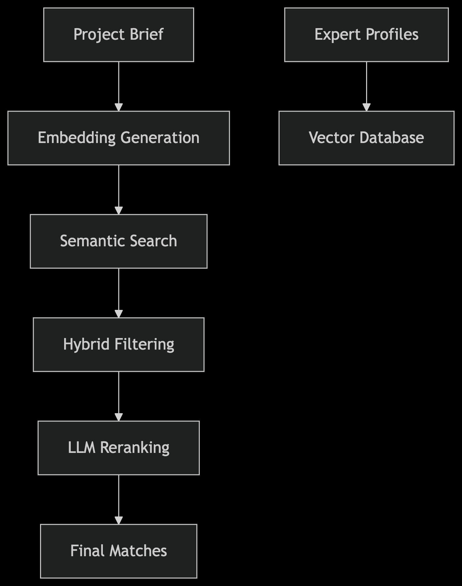

# Project Matchmaker 🔍🤖

An intelligent system for matching project requirements with AI agents and human experts using RAG (Retrieval Augmented Generation) and semantic search.

## Features ✨
- Hybrid search combining vector embeddings + metadata filtering
- Multi-LLM support (OpenAI, Anthropic, Local Models)
- Skill-based expert profiling
- Domain-aware matching
- Configurable ranking strategies

## Installation 🛠️

```bash
git clone https://github.com/yourusername/project-matchmaker.git
cd project-matchmaker
python -m venv venv
source venv/bin/activate  # Linux/MacOS
# venv\Scripts\activate  # Windows

pip install -r requirements.txt

